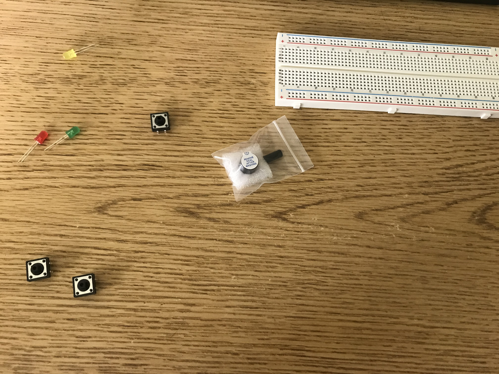
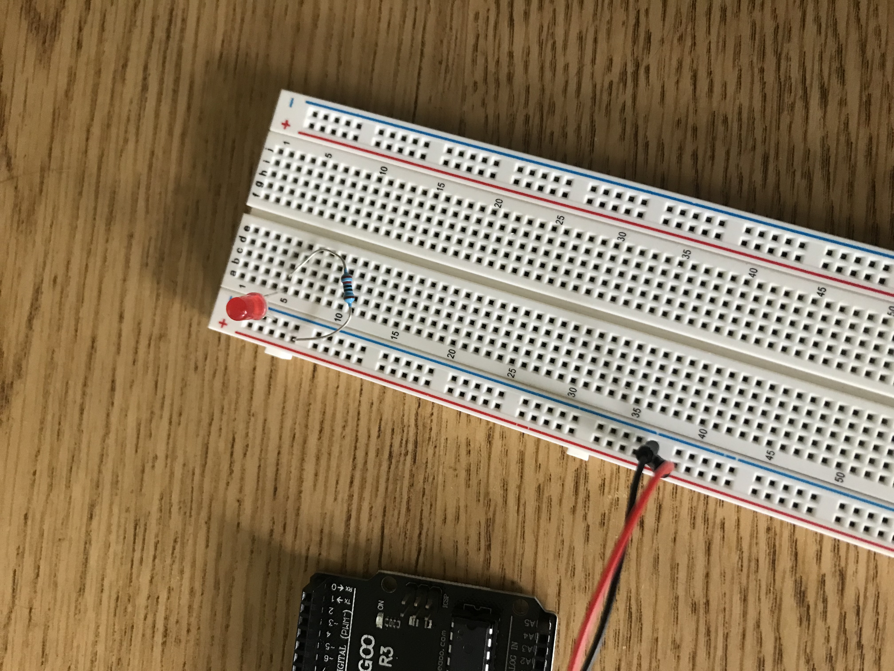
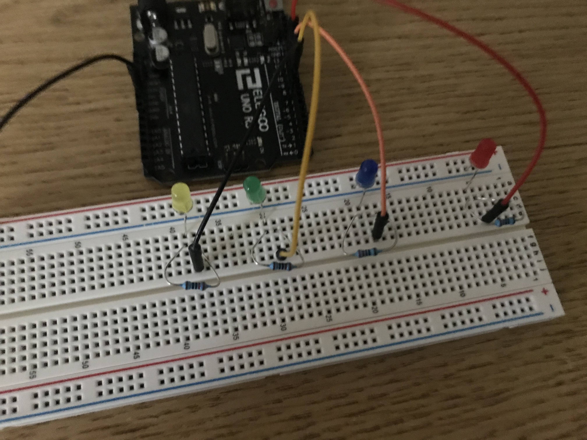
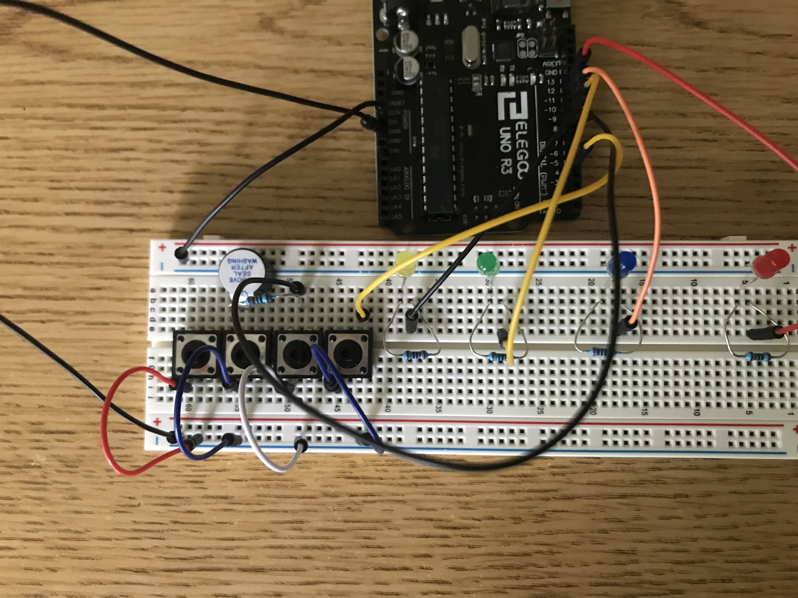
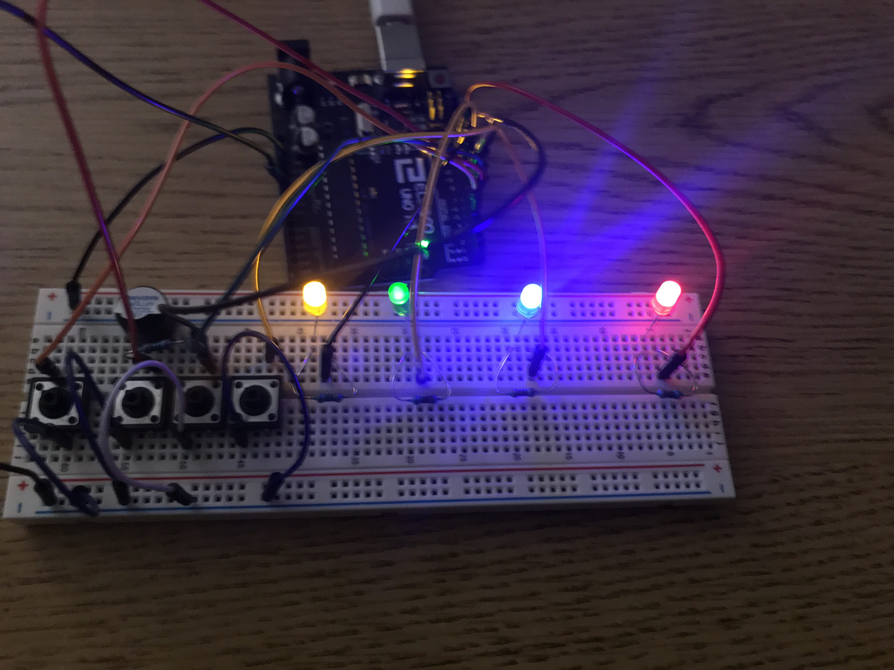

# arduino-simon

This is a recreation of the 70s game SIMON using arduino! I'm brand new to breadboards and resistors and all so it was a fun project.

## How the code works

It starts by setting pins 4-7 as Input Pullup, since these are the buttons pins. Pins 8-12 are set as OUTPUT. We also do `randomSeed(analogRead(A0))` because this randomizes the random() function using analog read. This pretty much reads tiny electrical signals in the air so it is truly random. Without this it would probably start on the same color every boot.

The playTone function is defined. I am not sure how it works *exactly* because I got it from an Instructables tutorial. But essentially it sends power for a specific amount of microseconds which determines the pitch. The function syntax is `playTone(tone, duration)` where tone is the number value of the tone and duration is how long in milliseconds to play it.

We then define `int length = 1;`. This is essentially how long the pattern is. So when the game begins, it starts with ONE random color. Then this integer increments.

hasBeenShown is defined, and this is basically what it checks in the loop to see if the code has been played yet. It's important because the game has two main phases - the watching and then the copying.

The code is stored as a string that has the corresponding number. Because of the wiring, this number can be added to or subtracted from in order to locate a button versus an LED.

`successAnimation()` basically just plays a broken C-E-G-C chord rapidly, which sounds a success sound, and then it blinks all 4 lights twice. It's very fun to watch haha.

Then we define the loop. The code is a little messy but it does the job.

We start by checking that `hasBeenShown` from earlier, and if it's false that means the code needs to show the pattern. It picks a random number 1-4 (you'll see 1,5 because arduino excludes the last number). Then it appends that number to the code string. We then loop through each number in the code string. `-'0'` converts it to a number. Using the switch statement, we play the appropriate tone depending on the number. We delay at a linearly decreasing speed (as the game progresses), although this isnt super noticeable until you get far into the game. Again this loops through all of them. Then it sets hasBeenShown to true so that the player can type the pattern.

The rest of the code is just button detection. If it reads LOW on any of the button pins, that is a button press. If the correct button is pressed, it plays its tone. If that was the last character in the tone, we play the success animation and set hasBeenShown to false in order to make it pick a new color to append.

If you get the color wrong, it plays 1700-1800-1915-2028, which is D-Db-C-B on piano. In other words, the WOMP WOMP trombone thing. Then it sets code to an empty string which just clears the board and again sets hasBeenShown to false. These buttons' code is roughly the same for all of them.

That is the end of the code analysis.

## Breadboard wiring:

### LEDs
Four colored LEDs. Cathode on - of breadboard, anode on any row. 220 Ohm resistor connected to digital pin.
Each LED is on pins 12, 11, 10, and 9.
### Buttons
They can go anywhere that goes across the median of the board. so long as this does not interfere with other things.
Button pin assignments are 7, 6, 5, and 4.

### Piezo buzzer
cathode on ( - ) and anode on any row. OPTIONAL 220 Ohm resistor to make it quieter.

### Ground
GND to - on both sides.

## Images!

### Me gathering parts

### My first LED!

*With a resistor, lol. I used to plug LEDs in with no resistor!!! Good thing I learned now!

### Adding all 4 LEDs.

### Completed build

### Project thumbnail (completed and all LEDs lit)

## Videos

### Getting all 4 LEDs to work and the buzzer

<video src="media/leds-and-buzzer.mp4" width="320" height="240" controls></video>

### Final Demo

